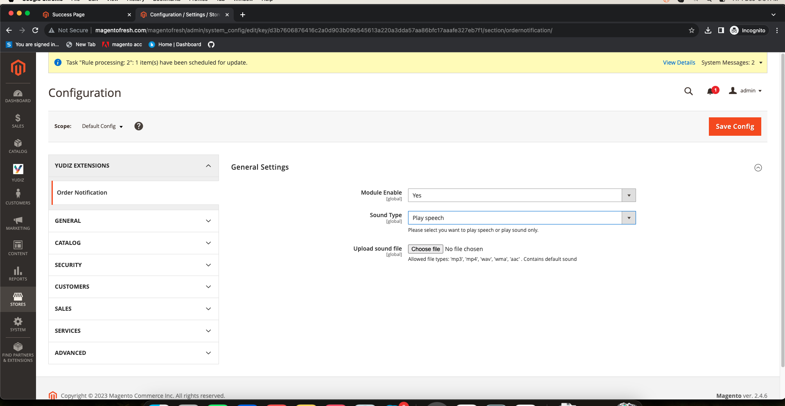

# OrderNotification Extension for Magento 2
The Magento 2 OrderNotification module enables the Admin to receive notifications through sound whenever a new order is placed.

## Installation

You can install the Yudiz OrderNotification Extension using one of two methods:
 1. Via Composer 
 2. By downloading it directly from the available source.

### 1. Install via composer

Before installing the Yudiz OrderNotification Extension, it is necessary to install the Yudiz Core module. You can obtain the Yudiz Core module by using the following code.

Run the following command:
```shell
composer require yudiz/module-core
```
Now, To install the Yudiz OrderNotification Extension via Composer, follow these steps in   your Magento 2 root folder:

Run the following command:
```shell
composer require yudiz/ordernotification
```
After a successful installation, execute the following commands:

```shell
php bin/magento setup:upgrade
php bin/magento setup:static-content:deploy -f
php bin/magento c:c
```

With these steps completed, you'll be ready to utilize the Yudiz OrderNotification Extension.

### 2. Download Directly

Before Downloading the Yudiz OrderNotification Extension, it is necessary to have the Yudiz Core module. You can download the module directly from below link:

https://github.com/yudiz-ritikapatel/yudiz-core

Once the zip file is downloaded, extract its contents within the 'app/code/Yudiz/Core' directory.

Now, To install the Yudiz OrderNotification Extension you can download the Extension from below link:

https://github.com/yudizgordhan/admin-order-sound-notification

After successfully downloading the module, follow these steps to install it:

1.Unzip the downloaded folder.

2.Place the unzipped extension folder into the following path:

```shell
project-root-directory/app/code/Yudiz/OrderNotification
```

Indeed, after placing the extension folder in the specified directory, follow these Magento commands to complete the installation:
```shell
php bin/magento setup:upgrade
php bin/magento setup:static-content:deploy -f
php bin/magento c:c
```

By following these 2 Ways you can easily obtain and install the module.  For detailed instructions on its usage, refer to the user guide within this document.


## Features 
1. Admin can Enable / Disable module from configuration settings.
2. Admin has 2 options to select for play sound (play his/her custom sound file or speech).
3. Admin can upload his/her own sound file for notification

## Magento 2 OrderNotification User Guide (ADMIN)

This guide provides step-by-step instructions on how to integrate a banner slider into the homepage of your Magento 2 store.

Login to the **Magento Admin**, navigate to `Yudiz -> Configure OrderNotification `.

<div>
    
</div>

</br>

- Module Enable:  Select `Yes` to activate the module and No to disable it.
- Sound Type: Select SoundType either you want to play sound or play speech.
- Upload Sound Type: Upload the audio file that you wish to hear when a new order occurs. This feature is optional as default values are also available.

After saving these settings, when a new order occurs, you will be able to hear the order notification sound. 

#### However, it is necessary to refresh the admin panel once and remain in the admin panel tab to receive the notification.


